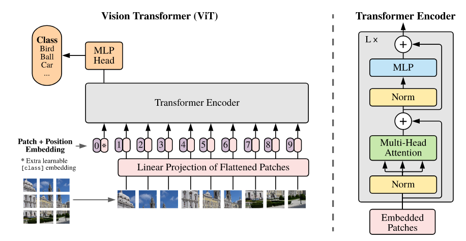
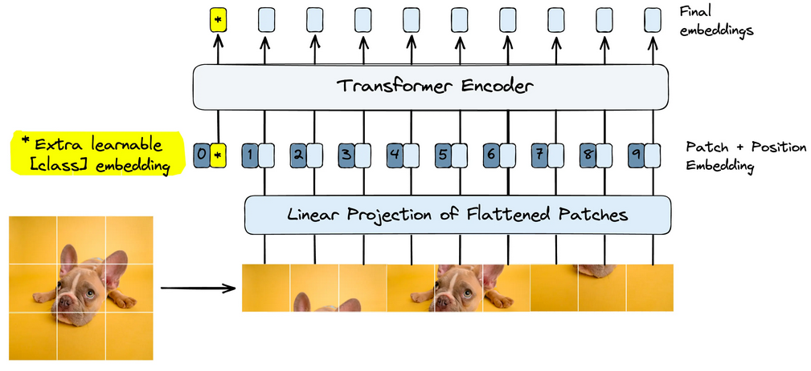
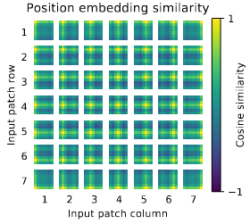

# ViT-for-MNIST

Visual transformer trained for handwritten digit recognizing. 



> [!NOTE]
>
> Created for educational purposes. Images and illustrations are taken from resources linked below. 
> Link to the original paper can be found in the resources. 


## Theory 

From the paper: "AN IMAGE IS WORTH 16X16 WORDS:  TRANSFORMERS FOR IMAGE RECOGNITION AT SCALE": <br>
https://arxiv.org/pdf/2010.11929 

This paper was published after the transformer architecture had become the standard within NLP. This paper showed that not only could transformers be applied to computer vision, but it beats standard CNNs in complicated image classification tasks. The paper introduces the Visual Transformer (ViT). 

Note that: 
- Initial attempts tried to use CNNs with attention mechanism has been tried, but where not scalable. 
- Transformers can be trained on 100B parameters! 
- Inductive bias from the transformer is handled by providing large dataset 
- ViTs had great results, but they where pre-trained on large datasets (14 to 300 million images)


### Patch embeddings 

From the illustration in the paper, we can see that the first step is to turn the given image into patches. 
This is the same strategy for NLP tokenizing. We turn an image into patches for the attention mechanism. 
Attention works only if well if our patches is large enough, so smaller patches (or pixels) does not work. They also become expensive to compute. 

The patches are turned into patch embeddings with linear projection. We use convolution to do this with `nn.Conv2d` from Pytorch. The goal is to turn each patch into a feature vector that hold "semantic" information about the given patch. This makes it easy to processes for the transform encoder. 


### Adding a learnable embedding

The learnable embedding was a strategy used by the language model BERT. When they fine-tuned for classification, they used the special token `[CLS]` (for classification). The token itself was a black token without meaning for the input itself. The actual reason for adding such a token was that the multi-head attention to learn the representation of the whole sequence of embeddings, which is the class of the sentence! The image below shows how the ViT paper applies the same concept for images. The learnable embedding is used as the class for the image, and the multi-head attention mechanism is able to learn class of the given sentence:



### Positional embeddings

The patched embedding is not enough. The order of images matter for classification. For example for handwritten digits, if a patch has a circle, it matter a lot where the circle is relative to the other images. If we don't know where the patch was, then it will be much harder to classify. This makes logical sense. A human, given a set of patches that where shuffled, would make a mistake. Positional information is important. 

Positional embeddings gives us ordering. For ViTs they are learned vectors that are added to the patch embeddings before given to the Transformer. The model learns the best way to encode positional information. After training the authors saw that the is cosine similarity between the given tile of the patch (row and column), and the positional embedding. This confirms that




## Resources

The paper: "An Image is Worth 16x16 Words: Transformers for Image Recognition at Scale"

```bibtex
@misc{dosovitskiy2021imageworth16x16words,
      title={An Image is Worth 16x16 Words: Transformers for Image Recognition at Scale}, 
      author={Alexey Dosovitskiy and Lucas Beyer and Alexander Kolesnikov and Dirk Weissenborn and Xiaohua Zhai and Thomas Unterthiner and Mostafa Dehghani and Matthias Minderer and Georg Heigold and Sylvain Gelly and Jakob Uszkoreit and Neil Houlsby},
      year={2021},
      eprint={2010.11929},
      archivePrefix={arXiv},
      primaryClass={cs.CV},
      url={https://arxiv.org/abs/2010.11929}, 
}
```

Embedding Methods for Image Search By James Briggs & Laura Carnevali <br>:
https://www.pinecone.io/learn/series/image-search/

Article on ViT (from the same article series above ^): <br>
https://www.pinecone.io/learn/series/image-search/vision-transformers/


BERT: Pre-training of Deep Bidirectional Transformers for Language Understanding: <br>
https://arxiv.org/abs/1810.04805